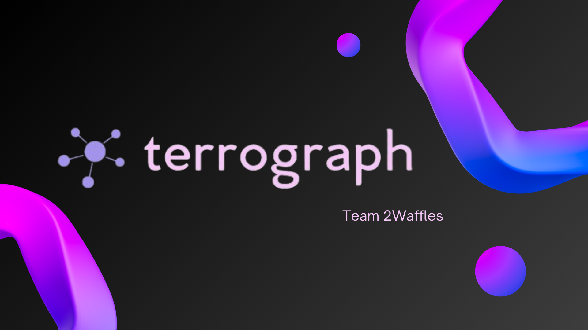
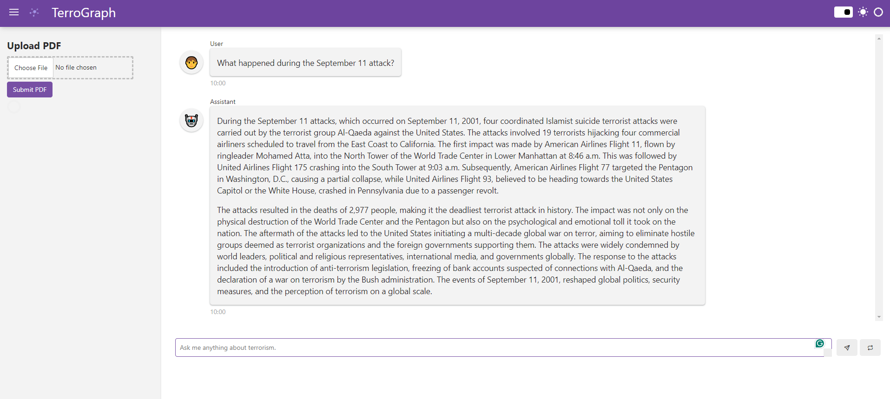

# LifeHack 2024 - TerroGraph

## _TerroGraph: Graph Your Way Out of Terror Confusion_ <br/>By 2Waffles

<div>


</div>



#### Team Members

- [Tristan Tan](https://github.com/tristantanjh)
- [Oscar Qian](https://github.com/oscarqjh)
- [Joshau Goh](https://github.com/joshuagohez)
- [Qu Zhetao](https://github.com/quzhetao01)

#### Group Details

- Group Name: 2 Waffles
- Project Name: TerroGraph

#### [Video Demo Link](https://www.youtube.com/watch?v=n5GImspdNGE)

_Made for [NUS' LifeHack 2024](https://devpost.com/software/terrograph) - Theme 3, Subtheme 2. **This project won 3rd Place. Check out the [DevPost Page here](https://devpost.com/software/terrograph)!**_

## Table of Contents

- [Project Details](#project-details)
- [Features](#features)
- [How We Did It](#how-we-did-it)
- [Challenges Faced](#challenges-faced)
- [What We Learnt](#what-we-learnt)
- [Installation](#installation)

## Project Details

Reports and articles on terrorism usually contain a lot of text, which are unstructured and difficult to resolve across reports in an automated fashion. For instance, linking articles about a terror incident, all coming in at different times in a day with varying details, can be challenging. Each report contains entities (Person, Object, Location, Events) that could be represented in a knowledge graph and accessed through a chatbot. TerroGraph aims to design and implement a Large Language Model (LLM) that can extract entities from reports into a knowledge graph, and an LLM that can answer questions based on the generated knowledge graph.

## Architecture


## Features

Our project leverages LLMs (OpenAI) and Neo4j's knowledge graphs to create a comprehensive system for managing and querying information about terrorism incidents. The project consists of several key components:

1. **User Interface**



- Chatbot: The chatbot interface allows users to ask queries about terrorism. It retrieves relevant information from the Neo4j database and provides responses based on the knowledge graph.
- PDF Uploader: Users can upload PDF files containing articles about terrorism. The system extracts text from the PDFs, processes the content to identify entities, and updates the knowledge graph accordingly.

2. **Backend Components**

- Knowledge Graph: A Neo4j-based graph database that stores entities (Person, Object, Location, Events) and their relationships extracted from terrorism reports and articles.
- Web Scraper: A scheduler-based web scraper that periodically gathers new articles from reputable news sources and updates the knowledge graph.
- RAG Model: Combines information retrieval and generation to provide accurate and relevant responses to user queries by leveraging both the knowledge graph and external web searches.

## How We Did It

1. Knowledge Graph Prepopulation:

<p align="center">
  
</p>

- Collected data from an online database of known terror attacks.
- Processed the data to extract entities and relationships.
- Populated the Neo4j knowledge graph with the preprocessed data.

2. RAG Model Implementation:

- Integrated a Retrieval-Augmented Generation model to handle user queries.
- Configured the model to retrieve relevant nodes and relationships from the Neo4j database.
- Set up the LLM to generate responses based on the retrieved information.

3. LangGraph Routing

<p align="center">
  
</p>

- Using LangChain's Langgraph API, we implemented agent-based routing for different LLM outputs.

4. Web Scraping Scheduler:

- Developed a web scraper to collect news articles from AP News and CNA.
- Implemented a scheduling mechanism to run the scraper weekly.
- Processed and indexed the scraped articles in a MongoDB database to ensure no duplicates.

5. PDF Processing:

- Created a function to extract text from uploaded PDFs using Tesseract OCR.
- Developed an entity extraction pipeline to identify and store relevant entities in the knowledge graph.
- Allowed users to upload PDFs through the chatbot interface.

6. Web Search Functionality:

- Configured the LLM to perform web searches if the knowledge graph does not contain sufficient information to answer a user query.
- Extracted relevant information from the web search results and included it in the chatbot response.

## Challenges Faced

We faced numerous challenges in the process of this project. Here's what we encountered:

- Finding a Proper Prompt: crafting an appropriate prompt for the language model to generate relevant and accurate responses was difficult. Defining the right level of specificity and context was crucial to ensure the model could effectively leverage the knowledge graph and external information sources.
- Data Preprocessing: Preprocessing the data from various sources, including PDF files and web articles, presented its own set of challenges. We had to handle different file formats, extract relevant information, and clean the data to ensure consistency and accuracy before populating the knowledge graph.
- Finding the Proper Technologies: Selecting the right technologies and tools for each component of the project was a non-trivial task. We evaluated various options for knowledge graph databases, language models, web scraping libraries, and other tools before settling on the final tech stack that met our requirements.

## What We Learnt

Throughout the course of this project, we learned several key lessons:

- Entity Extraction: Extracting structured information from unstructured text is a challenging yet crucial step in building a useful knowledge graph. We learned various techniques for entity extraction and relationship mapping.
- Knowledge Graphs: Working with Neo4j provided insights into the advantages of graph databases, especially for storing and querying complex relationships between entities.
- LLM Integration: Integrating LLMs with knowledge graphs can significantly enhance the ability to retrieve and generate relevant responses, demonstrating the power of combining different AI technologies.
- Web Scraping: Developing a reliable and efficient web scraping system taught us the importance of handling various edge cases and ensuring data quality.
- Scheduling and Automation: Implementing scheduling mechanisms for periodic tasks (like web scraping) highlighted the importance of automation in maintaining an up-to-date knowledge base.

## Installation

Before running the application, make sure that you have all prior dependencies installed (python, panel, pymupdf, langchain, openai, etc), and that you have a mongodb atlas account, an openAI API key, and a neo4jJ instance set up.

1. Clone the repository to your local machine.

```bash
git clone https://github.com/tristantanjh/2waffles.git
```

2. (Optional) Create either a python virtual environment or use Anaconda package manager to handle the dependencies required for this project.

3. Install all required dependencies. A detailed list of dependencies can be found in `requirements.txt`.  
   Special care have to be taken when installing _pytesseract_. Please refer to the installation guide for pytesseract on the official [github repo](https://github.com/UB-Mannheim/tesseract?tab=readme-ov-file).

4. Create a `.env` file in the root directory.

```bash
OPENAI_API_KEY=<YOUR_API_KEY>
NEO4J_URI=<YOUR_URI>
NEO4J_USERNAME=<YOUR_INSTANCE_USERNAME>
NEO4J_PASSWORD=<YOUR_INSTANCE_PASSWORD>
MONGO_PASSWORD=<YOUR_MONGODB_PASSWORD>
```

<dl>
  <dd>
    Note: You will have to populate the Neo4j database using 2 methods:     
  
    
  </dd>
</dl>
<dl><dd><dl><dd>
I. Load and import <code>/data/neo4j_model.json</code> together with <code>/data/globalterrorismdb_0522dist_short.csv</code> in the Neo4j dashboard.  
</dl></dd></dl></dd>
<dl><dd><dl><dd><dl>
    II. Run <code>/notebooks/scrapper.ipynb</code> to scrap CNA and APNews for latest news on terrorism and populate Neo4j knowledge graph. 
</dl></dd></dl></dd></dl>

5. Run `panel serve app.py` in your cmd for this environment.
6. Visit `http://localhost:5006/app` to explore the application!

---
